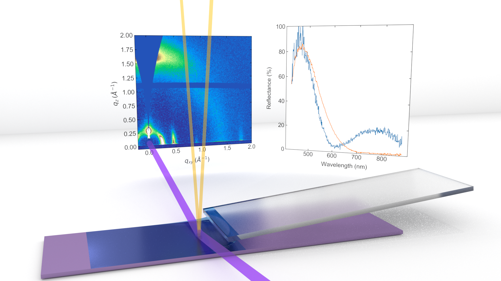

# in-situ-demo

This repository contains examples of the code used to perform the analysis and visualization of synchronized X-ray scattering / UV-Vis reflectance data for the paper [in situ Observation of Alignment Templating by Seed Crystals in Highly Anisotropic Polymer Transistors](https://tsapps.nist.gov/publication/get_pdf.cfm?pub_id=927323).

## Code examples

For tutorial on high-throughput UV-Vis analysis and visualization, see [2-UV-Example.ipynb](2-UV-Example.ipynb).

For tutorial on X-ray scattering calibration with pygix, see [3-X-ray-Calibration.ipynb](3-X-ray-Calibration.ipynb).

For an example of end-to-end analysis of X-ray and UV-Vis data together, with video creation, see [n22tol20_hi_nogr_1_mac.ipynb](n22tol20_hi_nogr_1_mac.ipynb).
